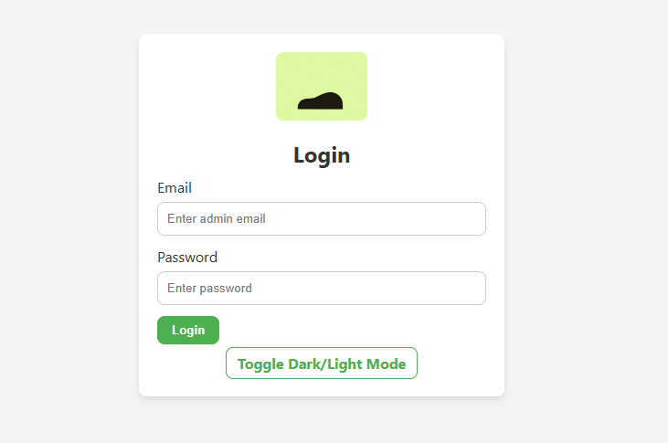
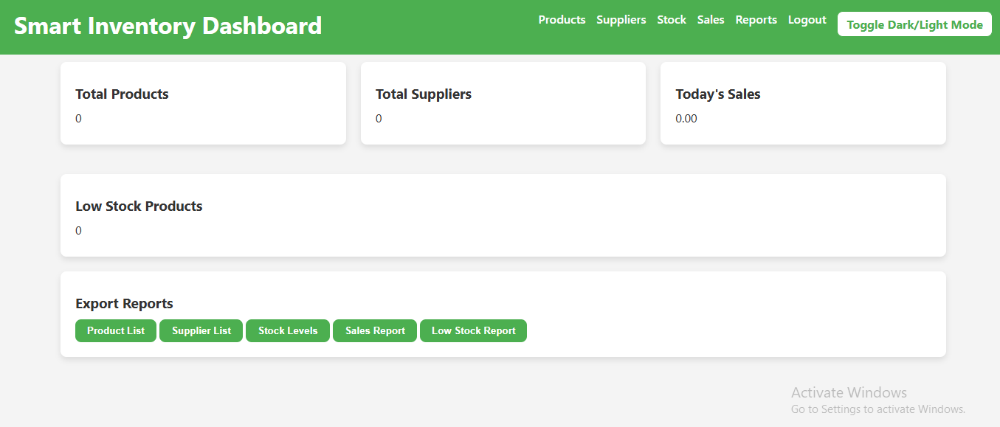
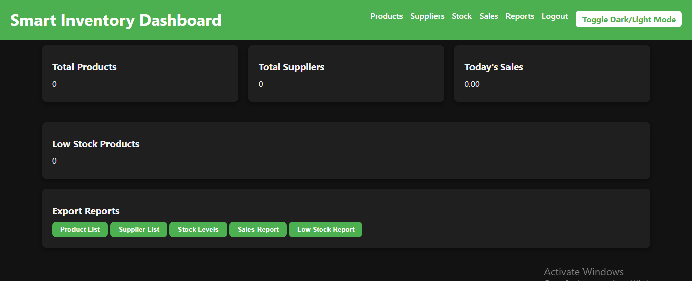
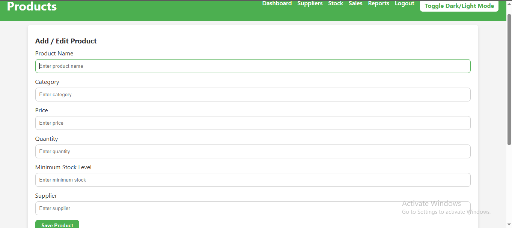
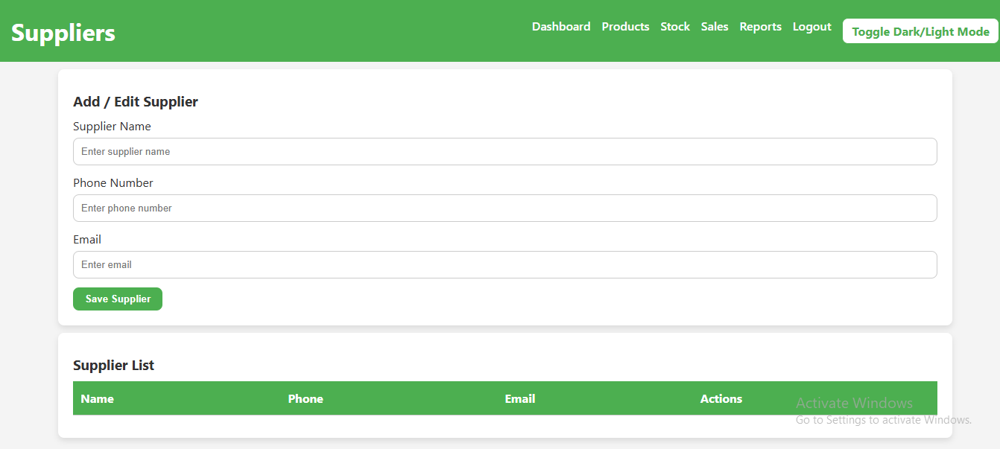
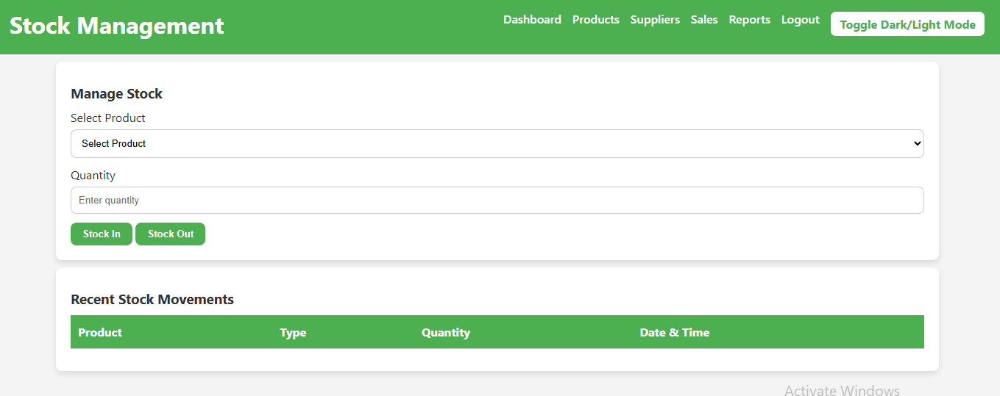
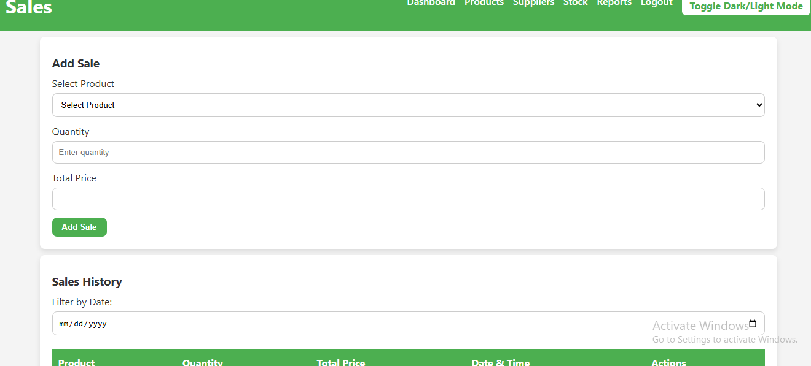
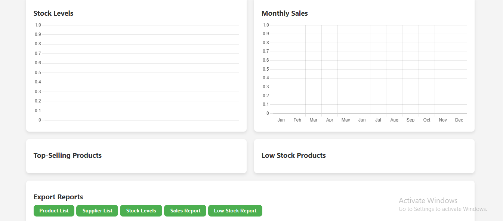
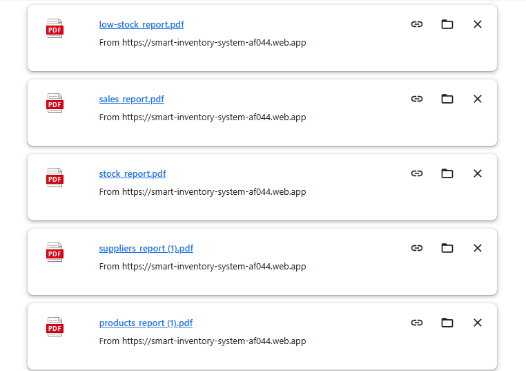

# 🛠 Smart Inventory System – Inventory & Stock Management

---

## 🚀 Project Overview

**Smart Inventory System** is a fully functional web-based inventory and stock management system built with **HTML, CSS, and JavaScript**, integrated with **Firebase** for authentication, database, and real-time data management.

**Purpose:**

* Manage products, suppliers, stock, and sales efficiently
* Generate reports and charts for inventory insights
* Export data as PDFs for professional reporting
* Demonstrate full-stack front-end skills with Firebase

**Key Highlights:**

* User authentication with Firebase
* CRUD operations for products and suppliers
* Real-time stock management
* Sales management with automatic stock reduction
* Charts and reports with exportable PDFs
* Dark/Light mode toggle for modern UI

---

## 🌟 Features

* **Products Management:** Add, edit, delete, search, and filter products
* **Suppliers Management:** Add, edit, delete suppliers and assign to products
* **Stock Management:** Stock In / Stock Out with quantity validation and history logs
* **Sales Management:** Add sales, auto reduce stock, view history, filter by date
* **Reports & Charts:** Stock levels, monthly sales, top-selling products, low-stock alerts
* **Export PDF:** Download reports for products, suppliers, stock, sales, and low-stock
* **Responsive Design:** Works on desktop, tablet, and mobile
* **Dark/Light Mode:** Toggle between themes

---

## 🛠 Tech Stack

| Technology | Role                                                    |
| ---------- | ------------------------------------------------------- |
| HTML       | Page structure and layout                               |
| CSS        | Styling, responsive design, cards, tables               |
| JavaScript | Interactivity, Firebase integration, PDF export, charts |
| Firebase   | Authentication, Firestore database, hosting             |
| jsPDF      | Generate PDF reports                                    |
| Chart.js   | Visualize data with charts                              |

---

## 📸 Screenshots Gallery

Here’s a visual walkthrough of the project:

| Screenshot    | Description                                                                           |
| ------------- | ------------------------------------------------------------------------------------- |
|  | **Login Page** – User authentication with dark/light mode                             |
|  | **Dashboard (Light Mode)** – Overview of products, suppliers, sales, and stock alerts |
|  | **Dashboard (Dark Mode)** – Same dashboard with dark theme                            |
|  | **Products Page** – Manage products with search, filter, and CRUD                     |
|  | **Suppliers Page** – Manage suppliers and assign to products                          |
|  | **Stock Page** – Stock In / Stock Out with history logs                               |
|  | **Sales Page** – Add sales, view history, and auto-update stock                       |
|  | **Reports Page** – Charts, low-stock alerts, top-selling products, PDF export         |
|  | **Downloaded reports** – Downloaded reports                                           |

---

## 🌐 Live Demo

Explore the live project here: [Smart Inventory System](https://smart-inventory-system-af044.web.app)

---

## 📖 Project Walkthrough

1. **Login Page (s1)** – Firebase authentication, dark/light mode toggle
2. **Dashboard (s2 & s3)** – Key metrics, alerts, and quick PDF download
3. **Products Page (s4)** – Manage inventory with add/edit/delete/search/filter
4. **Suppliers Page (s5)** – Manage supplier info and product assignment
5. **Stock Page (s6)** – Stock In / Out with validation and history log
6. **Sales Page (s7)** – Add sales, automatic stock reduction, and sales history
7. **Reports Page (s8)** – Charts, low-stock alerts, top-selling products, and PDF export

---

## 🧠 Skills & Learnings

* Building responsive web layouts with HTML and CSS
* Integrating Firebase Authentication and Firestore for real-time data
* Implementing CRUD operations and real-time updates
* Using jsPDF and Chart.js for professional reporting and visualization
* Designing dark/light mode themes for modern UX

---

## ⚡ Challenges & Solutions

**Challenges:**

* Real-time updates across multiple pages
* Exporting clean PDF reports with dynamic data
* Maintaining consistent UI/UX for dark/light mode

**Solutions:**

* Leveraged Firebase Firestore’s real-time updates
* Integrated jsPDF with structured data tables
* Used CSS variables and toggle class for theme switching

---

## 🔮 Future Improvements

* Add user roles (admin, staff) with permission control
* Enhance reporting with charts by category or supplier
* Add notifications for low-stock or sales targets
* Implement search and filter for sales history
* Include video demos or GIFs for better portfolio showcase

---

## 🎉 Conclusion

**Smart Inventory System** is a professional, full-featured inventory management web app demonstrating strong **front-end development skills**, Firebase integration, and real-time data management, suitable for portfolio and real-world usage.

---

